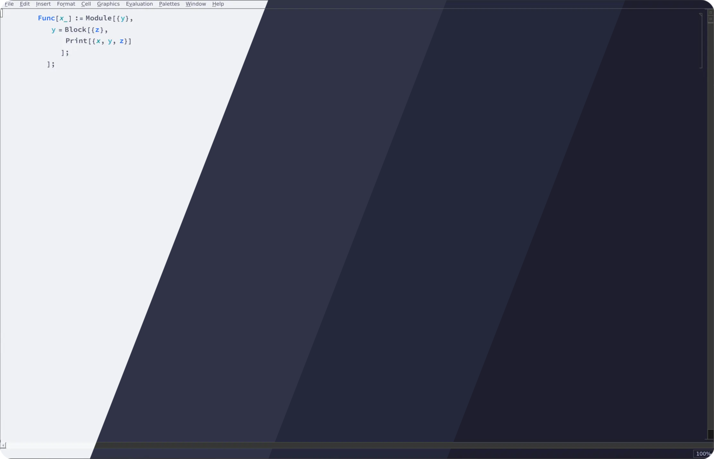
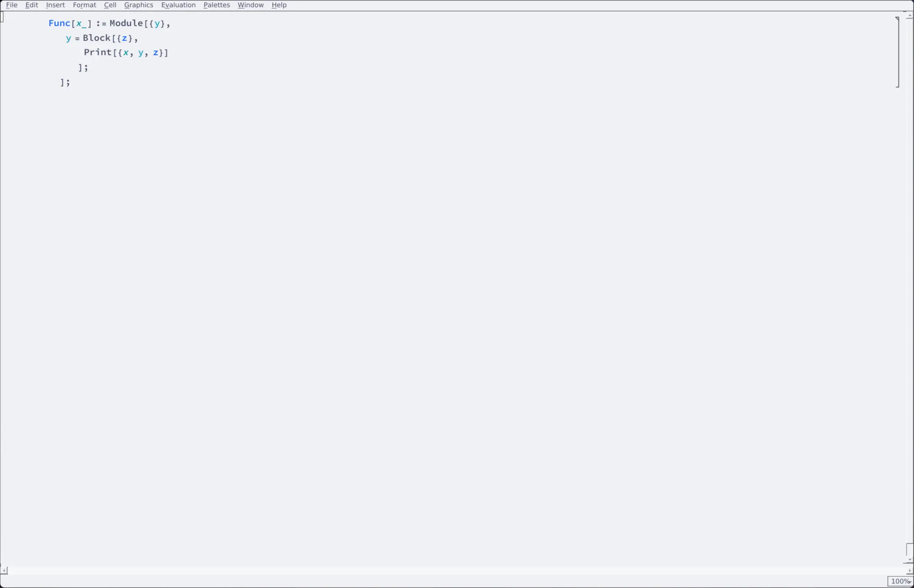
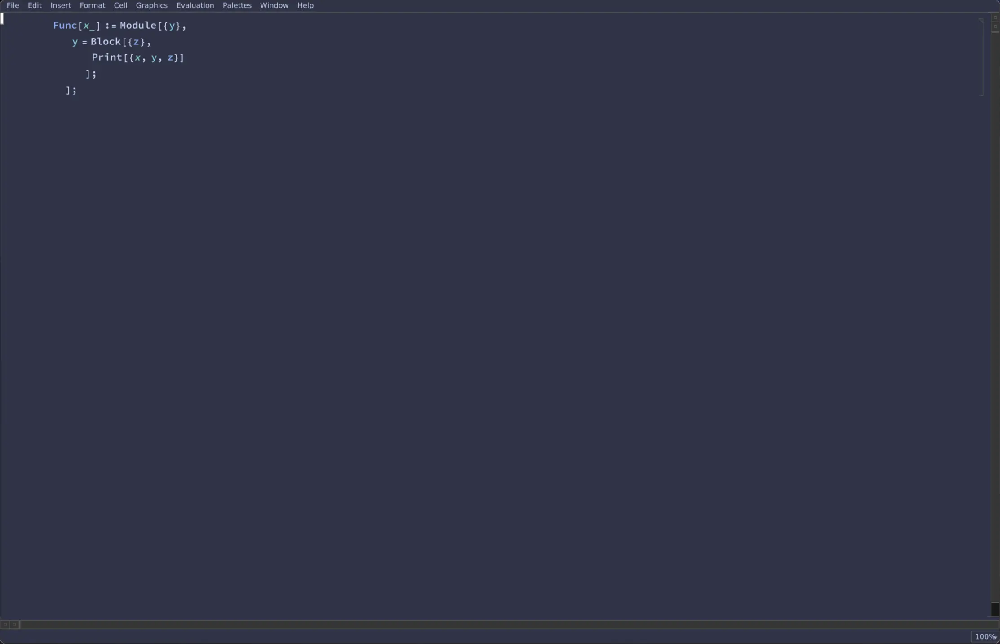
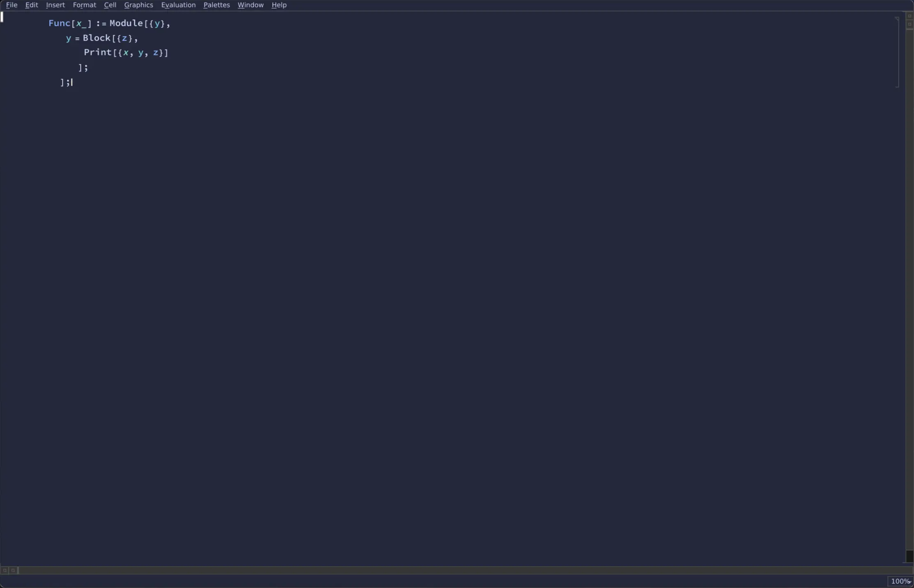
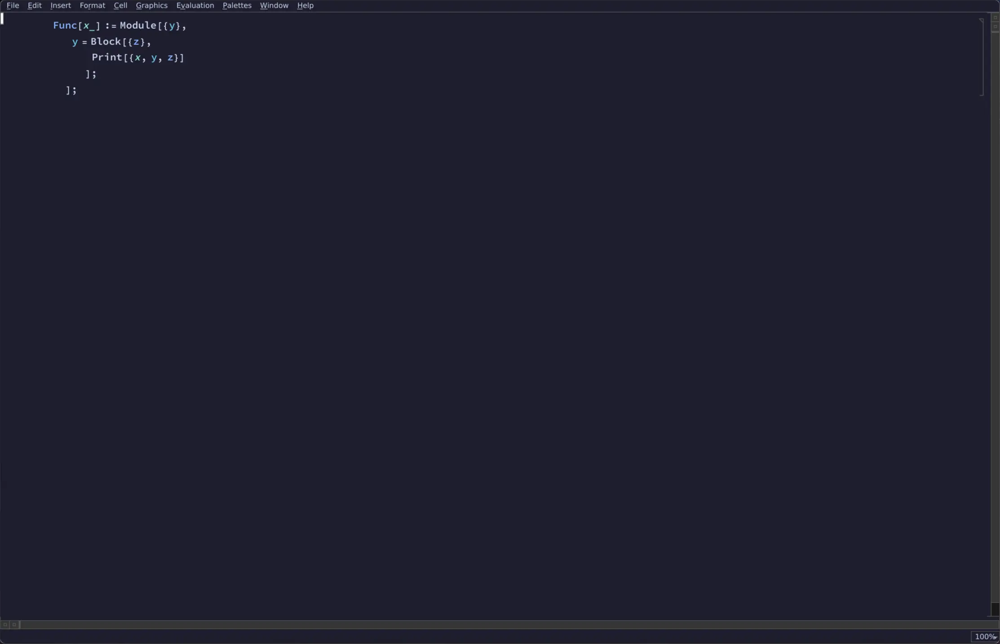

<h3 align="center">
	 
	
	Catppuccin for <a href="https://github.com/catppuccin/template">Mathematica</a>
	
</h3>

	
	
	

	

## Previews

🌻 Latte

🪴 Frappé

🌺 Macchiato

🌿 Mocha

## Usage

1. Download the `Catppuccin.nb` and `frontend.css` stylesheets from this repository, found under `themes/<flavor>/<accent>`.
2. Copy `frontend.css` to `~/.Mathematica/FrontEnd/frontend.css`.
3. Copy `Catppuccin.nb` to `~/.Mathematica/SystemFiles/FrontEnd/StyleSheets/Catppuccin.nb`. You may rename this file to whatever you like, as long as it has the `.nb` extension.
4. In Mathemtica go to `Format>Stylesheet` and select `Catppuccin` (or whatever you named it).

<!-- this section is optional -->
## 🙋 FAQ

-	Q: **_"It doesn't work"_**\
	A: I tested these themes using Mathematica 14. I am happy to look into issues that may arise in other versions but am also limited by which versions I can obtain.
-	Q: **_"Scrollbars look weird in Latte"_**\
  A: All themes are created with dark themed scrollbars. To revert to light themed scrollbars, simply remove all `QScrollBar` styles in `frontend.css`. 
-	Q: **_"I don't like the colours"_**\
  A: I am new to creating stylesheets and open to input on how to better use the colour palettes to theme Mathematica.
-	Q: **_"Styles do not persist"_**\
  A: There are [guides](https://support.wolfram.com/zh/29974?src=mathematica) out there for setting default stylesheets.
-	Q: **_"The Home/Student Edition banner is not styled"_**\
  A: There are several discussions on editing/removing these banners, including [here](https://mathematica.stackexchange.com/questions/11403/can-the-banner-in-the-home-edition-be-removed) and [here](https://mathematica.stackexchange.com/questions/9471/how-do-i-remove-the-top-bar-and-bottom-bar-from-the-students-mathematica-window).

## 💝 Thanks to

- [Elliott Sullinge-Farrall](https://github.com/ElliottSullingeFarrall) for creating this port.
- [Jakob Neef](https://gitlab.com/jakobneef) for creating `maTHEMEatica`. This helped streamline the creation of the themes.

&nbsp;

	

	Copyright &copy; 2021-present <a href="https://github.com/catppuccin" target="_blank">Catppuccin Org</a>

	

